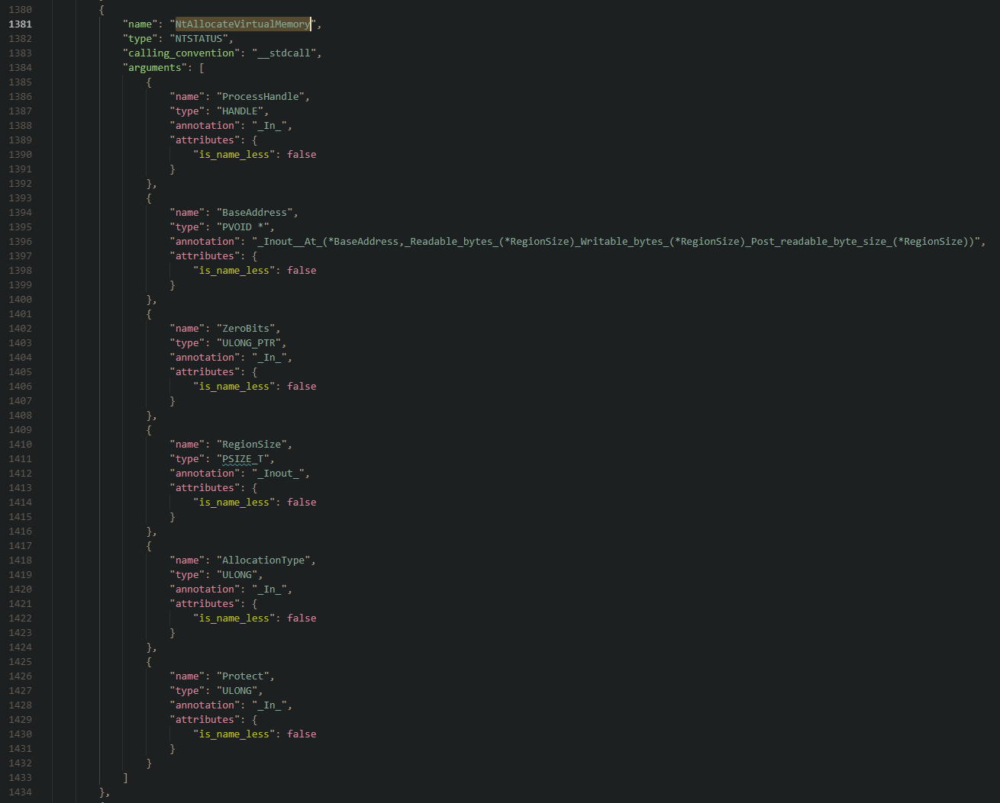

# sdkffi

The sdkffi (Not the best name in the world huh!) is a code parser for C-Style header files that lets you parse function's prototypes and data types used in their parameters. 

After parsing the code, the tool will let you generate a custom/new form of data, for instance, converting all function's prototypes to JSON 
a versatile format that could be used in many places (The initial idea of writing this tool was an auto-generating Hook body for logging Windows Syscalls)

The project consists of two-part, the Parser and the Generator.

- The parser is responsible for parsing C language to produce an object-based representation of the code.

- The generator is where you could implement your ideas. It could be a simple JSON serialization or to port
your header files to other languages, like the FFI(Foreign Function Interface).


# Output





# Notice


Currently I'm working on the DTrace generator to generate DTrace probes for Windows Syscalls, but it needs a lot of work to do, mainly on the data type parser.
The reason it's a bit hard to implement is the anonymous/nameless and nested structures (`union` and `struct`) in the Windows SDK definitions. We need to have a correct representation of them to be able to generate their corresponding logger function, for example consider the `UNICODE_STRING` structure we need to know its exact memory layout and data type of every fields in it. So if want to help this part is where you should look.

```c
typedef struct _UNICODE_STRING {
  USHORT Length;
  USHORT MaximumLength;
  PWSTR  Buffer;
} UNICODE_STRING, *PUNICODE_STRING;
```


# How to use

First of all You have to tell tool the include path of a specific version of Windows SDK.

To reduce the commandlines I just move clang's related commandline parameters to a file called [IncludePaths.json](sdkffi/clang_configs.json), you need to add correct `Include` paths or any predefined `Macro` in this file.


> Notice: you need the `"-m32",` if you are running the tool as a 64bit program.

```json
{
  "clang_configs.clang_args": {
    "clang_args": [
      "-X c",
      "-Xclang",
      "-fsyntax-only",
      "-fms-compatibility",
      "-fms-extensions",
      "-std=c99",
      "-fms-compatibility-version=19",
      "-m32",
      "--define-macro=SDKFFI_PARSER",
      "-DNTSYSCALLAPI",
      "--define-macro=NTSYSCALLAPI",
      "-IC:/Program Files (x86)/Windows Kits/10/Include/10.0.16299.0/shared",
      "-IC:/Program Files (x86)/Windows Kits/10/Include/10.0.16299.0/ucrt",
      "-IC:/Program Files (x86)/Windows Kits/10/Include/10.0.16299.0/um",
      "-IC:/Program Files (x86)/Windows Kits/10/Include/10.0.16299.0/winrt",
      "-IC:\\Dev\\Github\\processhacker\\phnt\\include"
    ]
  }
}
```

## Get installed Windows SDKs details

As I mentioned you have to add the correct include path of SDK's header files to the json config file, here is some handy scripts that helps you to find these paths easily.

```powershell
$sdk_10_root_path = (Get-ItemProperty -Path "HKLM:\Software\Microsoft\Windows Kits\Installed Roots").KitsRoot10
$sdk_81_root_path = (Get-ItemProperty -Path "HKLM:\Software\Microsoft\Windows Kits\Installed Roots").KitsRoot81


"SDK 10 Path  : {0} " -f $sdk_10_root_path
"SDK 8.1 Path : {0} " -f $sdk_81_root_path

Get-ChildItem "HKLM:\SOFTWARE\Microsoft\Windows Kits\Installed Roots" -NAME | foreach-object {
    $sdk_include_path = (Join-Path $sdk_10_root_path -ChildPath include\$_ )
   
    "`nInclude path of SDK version  :  {0} `n`n" -f ( Split-Path -Path $sdk_include_path -Leaf)

    if (Test-Path -Path $sdk_include_path) {
        Get-ChildItem -Directory -Path $sdk_include_path | foreach-object { "`"-I{0}`"," -f  ($_.FullName -replace "\\", "/") }
    }

    Write-Host 
}

```

In case you want to have a file that includes all available headers files in the SDK, use the following code.

```powershell
$sdk_10_root_path = (Get-ItemProperty -Path "HKLM:\Software\Microsoft\Windows Kits\Installed Roots").KitsRoot10
$sdk_81_root_path = (Get-ItemProperty -Path "HKLM:\Software\Microsoft\Windows Kits\Installed Roots").KitsRoot81


"SDK 10 Path  : {0} " -f $sdk_10_root_path
"SDK 8.1 Path : {0} " -f $sdk_81_root_path

Get-ChildItem "HKLM:\SOFTWARE\Microsoft\Windows Kits\Installed Roots" -NAME | foreach-object {
    $sdk_include_path = (Join-Path $sdk_10_root_path -ChildPath include\$_ )
    $sdk_version = ( Split-Path -Path $sdk_include_path -Leaf)
    
    if (Test-Path -Path $sdk_include_path) {
        Set-Content "sdk_ver_${sdk_version}_all_headers.h" ""
        Get-ChildItem -Recurse *.h -Path $sdk_include_path |  foreach-object {  Add-Content "sdk_ver_${sdk_version}_all_headers.h" "#include <`"$_`">" }
    }
}
```


```powershell

# Get the root installation directory path of all installed SDK/WDK on your system
Get-ChildItem "HKLM:\SOFTWARE\WOW6432Node\Microsoft\Microsoft SDKs\Windows" -NAME | foreach-object {(Get-ItemProperty -Path "HKLM:\SOFTWARE\WOW6432Node\Microsoft\Microsoft SDKs\Windows\$_").InstallationFolder}

# Get include paths of a specific version of SDK for instance  10.0.18362.0
Get-ChildItem -Path (Join-Path -Path (Get-ItemProperty -Path "HKLM:\SOFTWARE\WOW6432Node\Microsoft\Microsoft SDKs\Windows\v10.0").InstallationFolder -ChildPath Include\10.0.16299.0) | Select-Object FullName


# Get MSVC header files path
Get-ChildItem -Path (Join-Path -Path (& "${env:ProgramFiles(x86)}\Microsoft Visual Studio\Installer\vswhere.exe" -latest -property installationpath) -ChildPath VC\Tools\MSVC) | ForEach-Object { $_.FullName }

```


# Build

## Dependencies

```bat
.\vcpkg.exe install cereal:x64-windows cereal:x86-windows
.\vcpkg.exe install nlohmann-json:x64-windows nlohmann-json:x86-windows
.\vcpkg.exe install rang:x64-windows rang:x86-windows
.\vcpkg.exe install cxxopts:x64-windows cxxopts:x86-windows
.\vcpkg.exe install ms-gsl:x64-windows ms-gsl:x86-windows
.\vcpkg.exe install fmt:x64-windows fmt:x86-windows
```
